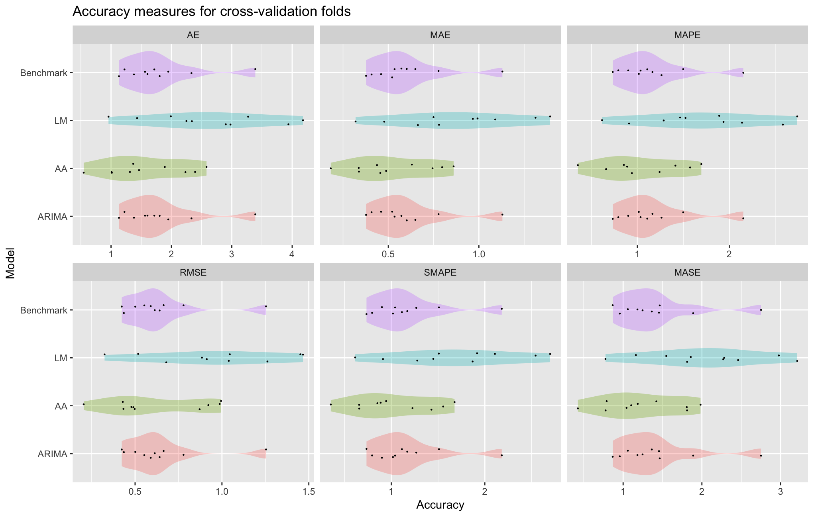

# validatr 

[](http://www.repostatus.org/#active)
[](https://travis-ci.org/camroach87/validatr)
[](https://codecov.io/github/camroach87/validatr)
[](https://CRAN.R-project.org/package=validatr)


Fits various models on training sets and calculates accuracy measures. Lots of packages have cross-validation functionality, but it's not very useful if you want to compare a model fit with a different package's method. The intention of this package is to allow for all other package methods to be assessed under identical conditions.

## Installation

From your R console, simply run:

```{r}
install.packages("devtools")
require(devtools)
devtools::install_github("camroach87/validatr")
```

## Examples

__Important:__ Make sure that the model names are consistent all the way through. For example, don't call something `LM1` in the `fit_models` function and then `Prediction_LM1` in the `calc_predictions` function. The code will fail in weird and mysterious ways which I have not yet explored. There are no plans to allow for this functionality as I believe this will make the code more difficult to use without really adding substantial benefits.

### Regression

A contrived, but hopefully illuminating example is given below. Here, four separate models from two different packages are fit to each fold's training data. The accuracy of each measure is then calculated on each fold's validation data.


```{r}
require(validatr)
require(randomForest)

validatr(iris, k = 10) %>%
  fit_models(LM1 = lm(Sepal.Length ~ ., data = train),
             LM2 = lm(Sepal.Length ~ Sepal.Width + Petal.Width, data = train),
             RF1 = randomForest(Sepal.Length ~ ., data = train, ntree = 10),
             RF2 = randomForest(Sepal.Length ~ ., data = train, ntree = 500)) %>%
  calc_predictions(LM1 = predict(LM1, newdata = validation),
                   LM2 = predict(LM2, newdata = validation),
                   RF1 = predict(RF1, newdata = validation),
                   RF2 = predict(RF2, newdata = validation)) %>%
  calc_accuracy(y = "Sepal.Length", average_folds = TRUE)
```

Gives the following output:

|Model |Statistic |        AE|       MAE|      MAPE|      RMSE|     SMAPE|
|:-----|:---------|---------:|---------:|---------:|---------:|---------:|
|LM1   |Mean      | 3.7950136| 0.2530009| 4.3516055| 0.3106914| 4.3318653|
|LM2   |Mean      | 5.2279834| 0.3485322| 5.8394677| 0.4438729| 5.8149103|
|RF1   |Mean      | 4.6498967| 0.3099931| 5.3175795| 0.3797383| 5.2790324|
|RF2   |Mean      | 4.4009540| 0.2933969| 5.0240645| 0.3626210| 4.9876589|
|LM1   |Variance  | 0.2791718| 0.0012408| 0.3347331| 0.0020096| 0.3032631|
|LM2   |Variance  | 2.0361152| 0.0090494| 2.8960415| 0.0101204| 2.5389126|
|RF1   |Variance  | 0.4620071| 0.0020534| 0.7933737| 0.0032892| 0.6486826|
|RF2   |Variance  | 0.6232808| 0.0027701| 1.0119045| 0.0047078| 0.8710760|

### Time-series

This approach can be adopted for time-series forecasting. If `data_type` is set to "ts", time-series cross-validation will be carried out. Additionally, the Mean Absolute Scaled Error (MASE) is also calculated. The time-series cross-validation parameters are:

* `start` is the start of the first fold.
* `horizon` is the length of the fold. 
* `shift` is the length of time to move forward.
* `ts` is the name of the variable containing time-series data.

Note that in `calc_predictions` a bit of work needs to be done to ensure `Arima()` returns a numeric vector of predictions. Since the number of rows in the final fold may be less than the horizon value of three, we specify `h = nrow(validation)` rather than setting it to 3.

__Important:__ have not tested this for ts variables that are of type POSIX or date yet.

```{r}
require(datasets)
require(forecast)

data = data.frame(Year = time(nhtemp),
                  Temp = nhtemp)

validatr(data, data_type = "ts", start = 1960, horizon = 3, shift = 1,
         ts = "Year") %>% 
    fit_models(ARIMA = Arima(train$Temp),
               LM = lm(Temp ~ Year, data = train)) %>% 
    calc_predictions(ARIMA = as.numeric(forecast(ARIMA, h = nrow(validation))$mean),
                     LM = predict(LM, newdata = validation)) %>% 
    calc_accuracy(y = "Temp", average_folds = FALSE) %>% 
    autoplot()
```

If `average_folds` is set to `FALSE` we can use the `autoplot()` function to produce density plots of each accuracy measure using the results from each fold. An example of the plot is given below:



### Classification

__TODO__

## Future improvements

Other improvements planned:

* Remove the need to specify `y = "Sepal.Length"` since we should already know "Sepal.Length" was used as the response.
* Accuracy measures for classification models.
* Quantile forecast assessments, i.e., pinball loss.
